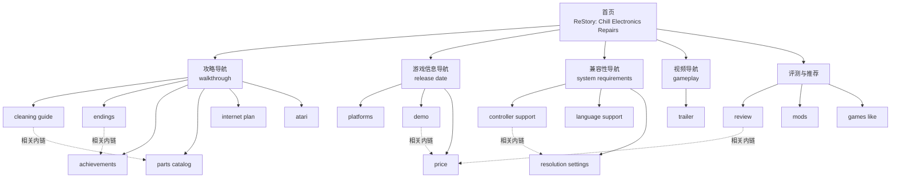

# ReStory: Chill Electronics Repairs 第一版页面矩阵

## 页面矩阵

| 编号 | 页面/建议 URL | 对应关键词 | 用户问题 | 页面类型 | 主要解决方式 | 主要入口/连接 |
| --- | --- | --- | --- | --- | --- | --- |
| 1 | `/` | `restory: chill electronics repairs` | 这是什么游戏？适合谁？新用户应该先看什么？ | 首页 | 提供游戏简介、核心玩法、发售状态和四类导航入口 | 所有一级导航 |
| 2 | `/guides/` | `restory: chill electronics repairs walkthrough` | 如何从头到尾推进主线？卡关时先查哪里？ | 攻略导航页 | 放置完整流程、清洁、结局、成就和设备攻略入口 | 首页 → 攻略导航 |
| 3 | `/guides/cleaning/` | `restory: chill electronics repairs cleaning guide` | 物品怎么拆解和清洁？清洁按钮和工具怎么用？ | 清洁攻略内页 | 按工具、步骤和常见错误说明清洁流程 | 攻略导航 → 本页；链接零件页 |
| 4 | `/guides/endings/` | `restory: chill electronics repairs endings` | 有几个结局？关键选择会怎样影响故事？ | 结局攻略内页 | 按章节列出选择、分支和结局触发条件 | 攻略导航 → 本页；链接流程页 |
| 5 | `/guides/achievements/` | `restory: chill electronics repairs achievements` | 全成就怎么解锁？哪些成就容易错过？ | 成就攻略内页 | 按主线、隐藏和可 miss 成就列出解锁条件 | 攻略导航 → 本页；链接结局页 |
| 6 | `/items/parts-catalog/` | `restory: chill electronics repairs parts catalog` | 电路板和维修零件在哪里获得？分别用于什么设备？ | 物品/零件内页 | 建立零件清单、来源、用途和对应维修任务 | 攻略导航 → 本页；链接设备页 |
| 7 | `/guides/internet-plan/` | `restory: chill electronics repairs internet plan` | 网络套餐怎么选？哪个方案更适合当前进度？ | 选择攻略内页 | 对比选项、成本、收益和推荐选择 | 攻略导航 → 本页；链接购买页 |
| 8 | `/devices/atari/` | `restory: chill electronics repairs atari` | Atari 设备和摇杆任务怎么维修？ | 设备攻略内页 | 单独拆解 Atari 相关任务、步骤和易错点 | 攻略导航 → 本页；链接清洁页 |
| 9 | `/info/release-date/` | `restory: chill electronics repairs release date` | 游戏何时发售？正式版和发售时间是什么？ | 游戏信息内页 | 给出发售节点、版本状态和更新时间线 | 首页 → 游戏信息 |
| 10 | `/info/platforms/` | `restory: chill electronics repairs platforms` | 支持哪些平台、设备和便携设备？ | 平台信息内页 | 按平台列出支持状态、版本差异和兼容说明 | 游戏信息 → 本页 |
| 11 | `/info/demo/` | `restory: chill electronics repairs demo` | Demo 是否可玩？内容多长？存档能否延续到正式版？ | Demo 信息内页 | 汇总 Demo 内容、时长、限制和存档说明 | 游戏信息 → 本页 |
| 12 | `/info/price/` | `restory: chill electronics repairs price` | 游戏多少钱？购买渠道和折扣如何？ | 购买信息内页 | 展示价格、购买方式和折扣信息 | 游戏信息 → 本页；链接相似游戏页 |
| 13 | `/support/system-requirements/` | `restory: chill electronics repairs system requirements` | 我的电脑配置能否运行？需要多少空间？ | 配置要求内页 | 分列最低、推荐配置和常见运行问题 | 首页 → 兼容性 |
| 14 | `/support/controller/` | `restory: chill electronics repairs controller support` | 是否支持手柄？按键能否自定义？ | 手柄兼容内页 | 说明支持情况、连接方式和输入问题排查 | 兼容性导航 → 本页 |
| 15 | `/support/languages/` | `restory: chill electronics repairs language support` | 支持哪些语言？如何切换或安装语言补丁？ | 语言支持内页 | 列出语言状态、切换步骤和补丁注意事项 | 兼容性导航 → 本页 |
| 16 | `/support/resolution-settings/` | `restory: chill electronics repairs resolution settings` | 分辨率、帧数和配置文件怎么调整？ | 设置排错内页 | 提供画面设置、FPS 锁定和配置文件排错步骤 | 兼容性导航 → 本页 |
| 17 | `/media/gameplay/` | `restory: chill electronics repairs gameplay` | 实际玩法是什么？维修、经营和剧情如何循环？ | 玩法/视频导航页 | 汇总官方玩法视频、实机演示和玩法说明 | 首页 → 视频导航 |
| 18 | `/media/trailer/` | `restory: chill electronics repairs trailer` | 官方预告片和发售预告在哪里看？ | 视频内页 | 按公告、玩法、Demo、发售时间整理视频 | 视频导航 → 本页 |
| 19 | `/review/` | `restory: chill electronics repairs review` | 这款游戏值不值得买？优缺点是什么？ | 评测内页 | 汇总玩法体验、优缺点、评价和适合人群 | 首页 → 评测；链接购买页 |
| 20 | `/mods/` | `restory: chill electronics repairs mods` | 有没有 Mod？如何安装、管理和卸载？ | Mod 教程内页 | 说明 Mod 来源、安装步骤和风险 | 首页 → 社区/扩展 |
| 21 | `/similar-games/` | `restory: chill electronics repairs games like` | 喜欢这款游戏，还能玩哪些相似游戏？ | 推荐内页 | 按维修、经营、叙事和氛围推荐相似游戏 | 首页 → 推荐；链接评测页 |

## 首页—导航—内页结构

## 内链规则

1. 首页只链接四个一级入口：攻略、游戏信息、兼容性、视频；评测和推荐作为次级入口。
2. 攻略导航页集中链接所有攻略、结局、成就、零件和设备内页，具体内页之间只链接直接相关内容。
3. 游戏信息页覆盖发售、平台、Demo 和价格，价格页链接到评测页，评测页再链接回购买页。
4. 兼容性导航页集中配置要求、手柄、语言和画面设置，避免把技术问题分散到首页。
5. 每个内页返回所属导航页，并在正文中加入 2—3 个相关内链，形成“首页 → 导航页 → 具体内页”的层级。
